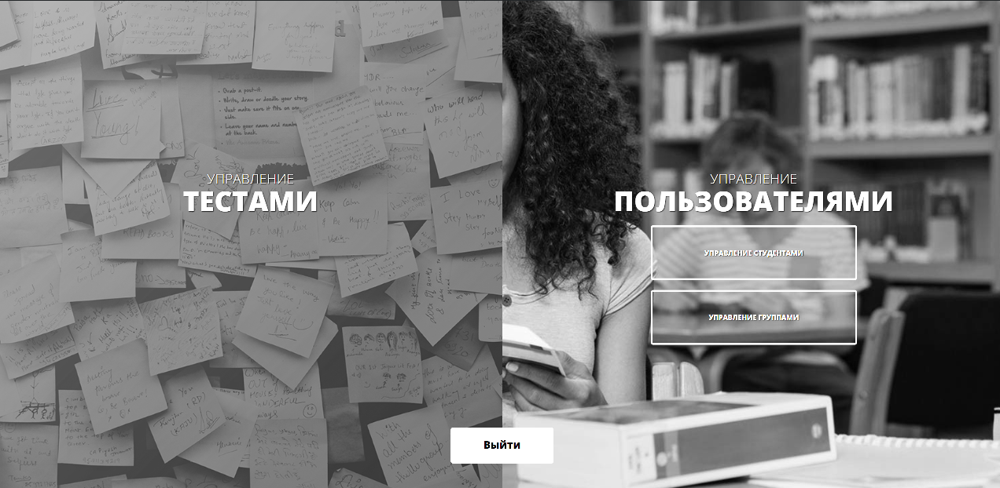
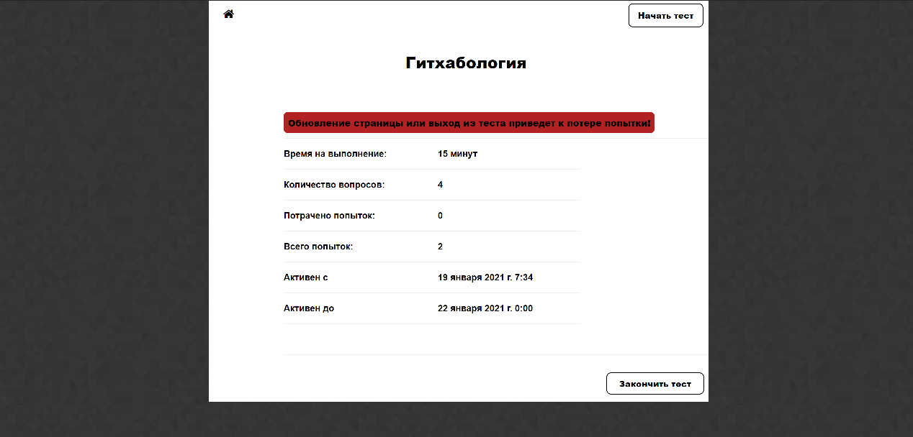
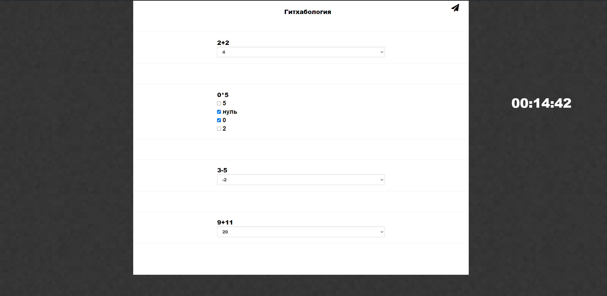

# Автоматизированная система тестирования

Автоматизированная система тестирования позволяет создавать и проходить тесты, поддерживающие как один, так и несколько правильных вариантов ответа.

Написано на Python 3.9 с использованием фреймворка Django 3.1

Тесты, пользователей и группы может создавать и изменять только администратор. Администратором является тот, у кого в свойствах аккаунта указано
`is_staff=True`

Администратор может менять принадлежность пользователя определенной группе, а также видимость теста для каждой группы. Таким образом, пользователь сможет проходить только те тесты, которые принадлежат его группе.

Функционал для того, чтобы увидеть результаты теста из админки пока не реализован.

Для запуска и корректной работы:

`pip install -r requirements.txt`

`Введите секретный ключ в auto_students_poll/settings.py`

Далее необходимо активировать БД (в данном случае SQLite)

`python manage.py makemigrations`

`python manage.py migrate`

Необходимо создать пользователя-администратора

`python manage.py createsuperuser`

Далее в админке можно создать пользователя с флагом is_staff или пользоваться суперпользователем.

Или если не хочется создавать суперпользователя, можно создать пользователя через 

`python manage.py shell`

`user = User(username='admin', is_staff=True)`

`user.set_password('password_here')`

`user.save()`

Далее при авторизации пользователя с флагом `is_staff=True` будет перенаправлять в панель администратора, с флагом `is_staff=False` на личную страницу каждого студента.

Страница авторизации:

Панель администратора:

Начало теста за студента:

Прохождение теста за студента:

